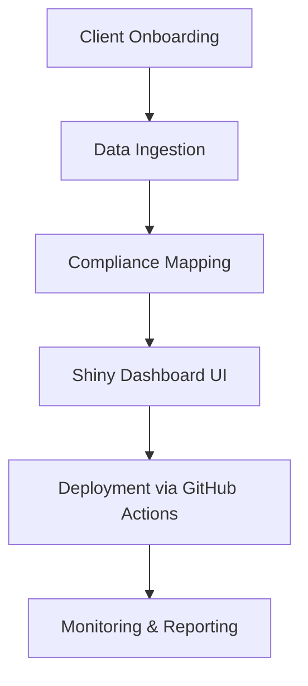

## 📁 Suggested Repo Name  
`founders-flightdeck-shiny`  

---

## 🗂️ Suggested Folder Structure
```
founders-flightdeck-shiny/
├── shiny/
│   ├── ui.R
│   ├── server.R
│   └── global.R
├── api/
│   └── fastapi_scaffold.py
├── data/
│   ├── mock_pipeline_status.csv
│   ├── compliance_overlays.csv
├── docs/
│   └── mermaid_workflow.md
├── LICENSE
└── README.md
```

---

## 🧠 RStudio Shiny App (`ui.R`, `server.R`, `global.R`)

### `global.R`
```r
library(shiny)
library(shinydashboard)
library(ggplot2)
library(dplyr)
library(httr)
library(jsonlite)
```

### `ui.R`
```r
dashboardPage(
  dashboardHeader(title = "Founder's Flight Deck"),
  dashboardSidebar(
    sidebarMenu(
      menuItem("Defense", tabName = "defense"),
      menuItem("Fintech", tabName = "fintech"),
      menuItem("Nonprofit", tabName = "nonprofit")
    )
  ),
  dashboardBody(
    tabItems(
      tabItem(tabName = "defense", h2("Anomaly Detection Dashboard")),
      tabItem(tabName = "fintech", h2("Fairness in Lending Insights")),
      tabItem(tabName = "nonprofit", h2("Transparency and Impact KPIs"))
    )
  )
)
```

### `server.R`
```r
server <- function(input, output, session) {
  # Placeholder for mock data loading, can be swapped with API later
  pipeline_data <- read.csv("data/mock_pipeline_status.csv")
  compliance_data <- read.csv("data/compliance_overlays.csv")

  # Future endpoint calls could go here
  # GET("http://localhost:8000/compliance")

  # Use pipeline_data and compliance_data for visualizations per tab
}
```

---

## ⚙️ FastAPI Scaffold (`api/fastapi_scaffold.py`)
```python
from fastapi import FastAPI

app = FastAPI()

@app.get("/compliance/{sector}")
def get_compliance(sector: str):
    return {
        "sector": sector,
        "regulations": {
            "defense": ["CMMC"],
            "fintech": ["GDPR"],
            "nonprofit": ["Ethical Transparency"]
        }.get(sector.lower(), [])
    }

@app.get("/status")
def get_pipeline_status():
    return {"pipeline": "Healthy", "regions": ["US", "EU", "Global"]}
```

---

## 🧭 Mermaid Diagram (`docs/mermaid_workflow.md`)


---

## 📋 README.md (Auto-linked Table of Contents, Shields, License & Explanation)

```markdown
# 🧭 Founder's Flight Deck – Shiny Intelligence Hub

## 📌 Table of Contents  
- [Overview](#overview)  
- [Tech Stack](#tech-stack)  
- [Folder Structure](#folder-structure)  
- [Workflow Diagram](#workflow-diagram)  
- [Installation](#installation)  
- [Why This Matters](#why-this-matters)  
- [License](#license)  
- [Conclusion](#conclusion)

---

## 📊 Tech Stack  


---

## 📁 Folder Structure  
Structure to organize client dashboards, API readiness, and CI/CD assets. [View All](#folder-structure)

---

## 🎯 Overview  
This RStudio-powered Shiny app replaces a PowerBI prototype with cross-sector client views. Includes scaffolding for future API connectivity and region-specific compliance overlays.

---

## 📈 Workflow Diagram  
See: [`docs/mermaid_workflow.md`](docs/mermaid_workflow.md)

---

## ⚙️ Installation  
- Clone repo  
- Load `.R` files into RStudio  
- Run FastAPI scaffold using: `uvicorn api.fastapi_scaffold:app --reload`  
- Populate `/data` with mock files or connect endpoints

---

## 💡 Why This Matters  
This dashboard isn't just a dev project—it's a leadership tool. In real-world consulting, clients want transparency, modularity, and strategic deployment. This simulation proves how to balance privacy, scalability, and speed in decision-critical apps.

---

## 📜 License  
DACR License – Ethical AI Use, No Closed Deployment Without Transparency

---

## ✅ Conclusion  
You now have a deployable, multi-sector Shiny prototype with GitHub and API-readiness. Customize it, share it, and lead with it.


